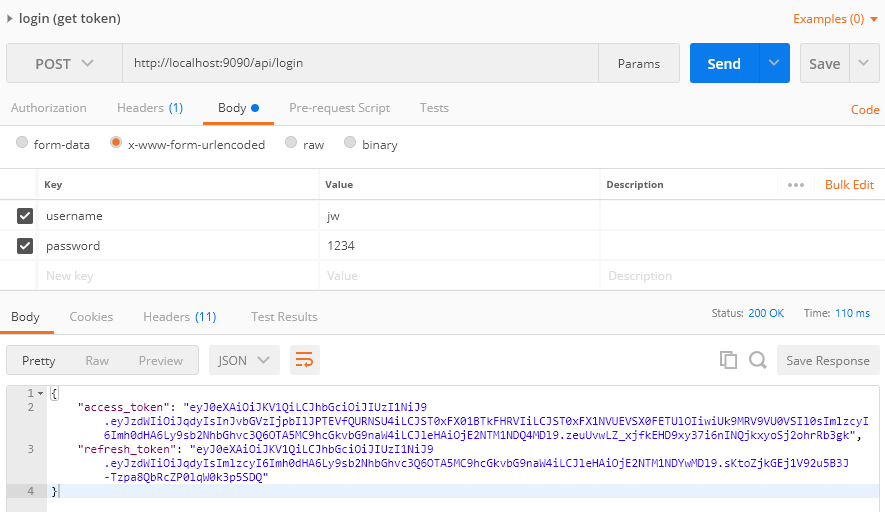
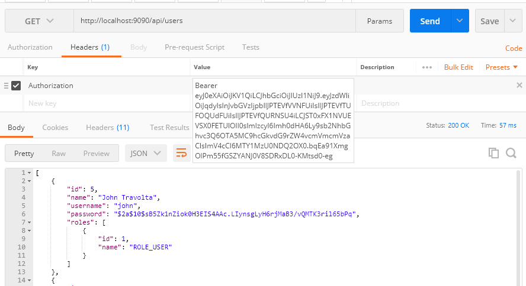
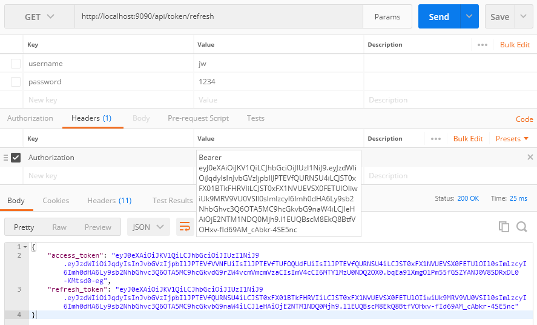

[Youtube 실습 - Spring Boot and Spring Security with JWT including Access and Refresh Tokens ](https://www.youtube.com/watch?v=VVn9OG9nfH0&t=43s)

### 로그인 (token 요청)

### 조회 (리소스 조회 api 요청)

### refresh token

